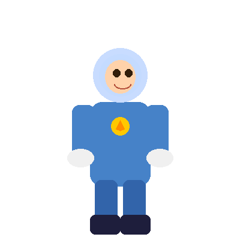

# 🎮 Assets du Template — Explorer Brave

## 📁 Structure

```
img/
├── icons/          → Icônes SVG (scalables, légères)
│   ├── Badges hexagonaux
│   │   ├── badge-lancement.svg
│   │   ├── badge-premiere-etape.svg
│   │   ├── badge-premiere-aventure.svg
│   │   ├── badge-premier-test.svg (x2)
│   │   ├── badge-premiere-rencontre.svg
│   │   ├── badge-semaine-continue.svg  🔥
│   │   ├── badge-examen.svg            🏆
│   │   ├── badge-lion.svg              🦁
│   │   └── badge-locked.svg            🔒
│   ├── Icônes des Pouvoirs
│   │   ├── icon-parole.svg             💬
│   │   ├── icon-cooperation.svg        🤝
│   │   ├── icon-idees.svg              💡
│   │   └── icon-courage.svg            🦁
│   ├── Icônes Carte/Stations
│   │   ├── icon-station-complete.svg   ✅
│   │   ├── icon-station-locked.svg     🔒
│   │   ├── icon-flag.svg
│   │   ├── icon-star-yellow.svg        ⭐
│   │   └── icon-star-smiley.svg
│   └── Icônes UI
│       ├── icon-calendar.svg
│       ├── icon-clock.svg
│       ├── icon-user.svg
│       ├── icon-book.svg
│       ├── icon-hourglass.svg
│       ├── icon-rocket.svg
│       ├── icon-search.svg
│       └── icon-checkmark.svg
└── illustrations/  → Images PNG (fonds & personnages)
    ├── Fonds
    │   └── bg-sky.png                  Ciel étoilé dégradé
    ├── Personnages
    │   ├── character-astronaut.png     Héros astronaute avec cape
    │   └── character-banana.png        Banane souriante
    ├── Décorations
    │   ├── deco-star.png
    │   ├── deco-cloud.png
    │   ├── deco-rocket.png
    │   ├── deco-flower-purple.png
    │   ├── deco-flower-pink.png
    │   └── deco-flower-blue.png
    ├── Carte
    │   └── map-path.png                Chemin sinueux
    ├── Barres de progression
    │   ├── progress-pink.png
    │   ├── progress-purple.png
    │   ├── progress-green.png
    │   ├── progress-yellow.png
    │   └── progress-red.png
    └── Panneaux
        ├── panel-white.png
        └── panel-mission.png
```

## 🎨 Palette de couleurs

| Élément | Couleur |
|---------|---------|
| Ciel | #1e78c8 → #64c8ff |
| Étoiles | #fde047 |
| Badges validés | #22c55e |
| Badges verrouillés | #6b7280 |
| Pouvoir Parole | #60a5fa |
| Pouvoir Coopération | #22c55e |
| Pouvoir Idées | #fbbf24 |
| Pouvoir Courage | #f97316 |

## 💡 Usage

```html
<!-- Icône SVG -->


<!-- Illustration PNG -->


<!-- Fond -->
<div style="background-image: url('illustrations/bg-sky.png')">...</div>
```
